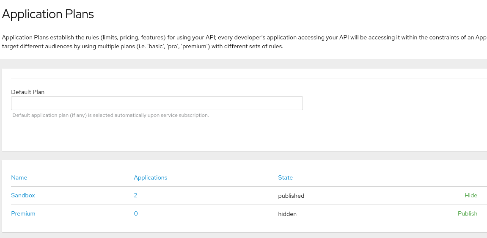
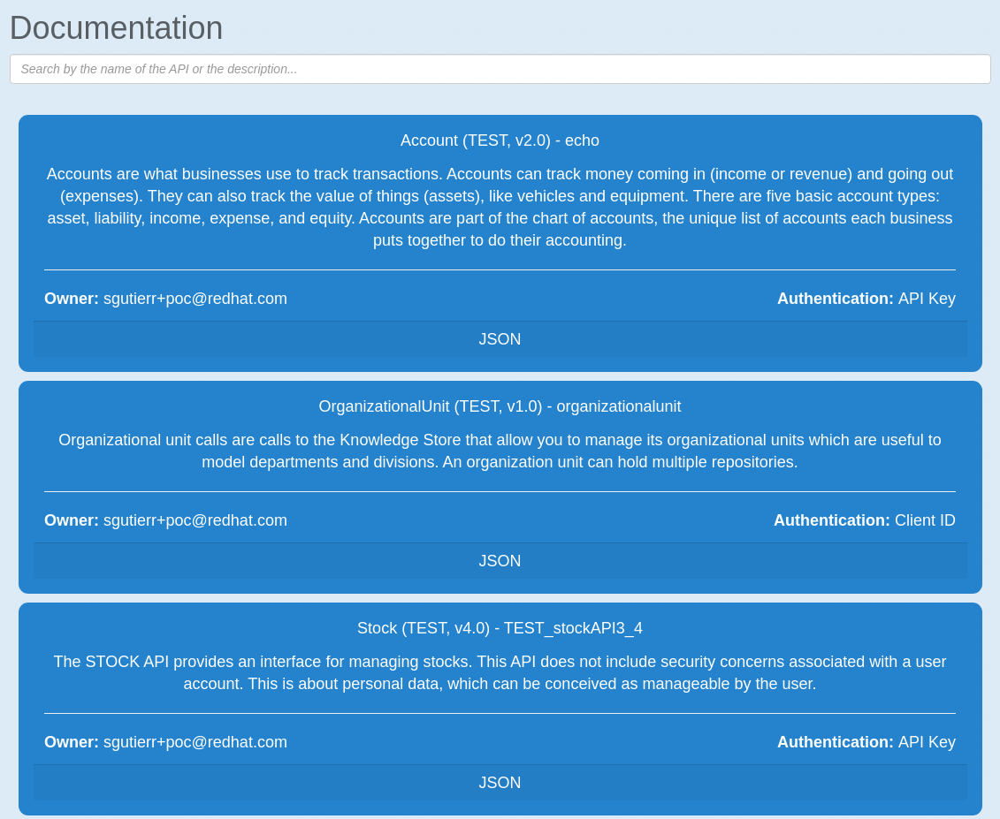
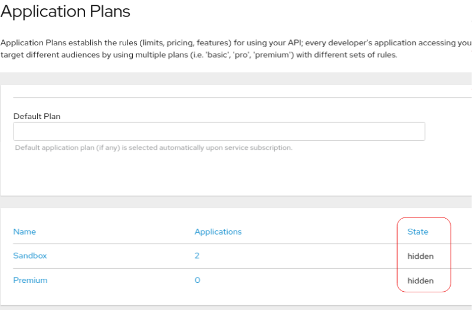
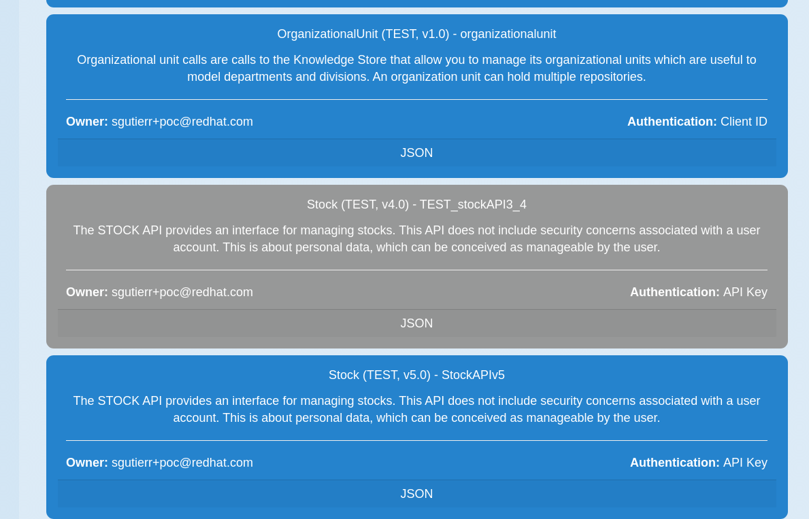
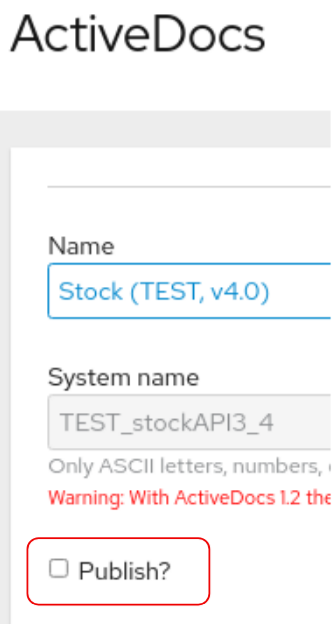
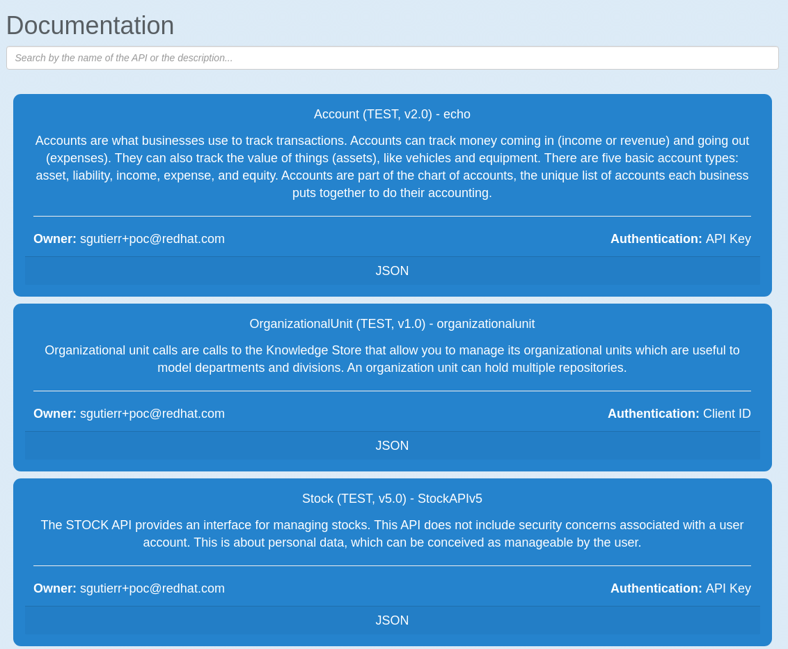

# 3scale Search

3scale search is an API Catalog where you can browse easily and manage the publication state of your APIs (unpublished/published/deprecated/retired) and their versioning. APIs from the 3scale search are published into the 3scale API Developer Portal to be easily consumed by developers.

## Unpublish/publish

A service with the unpublished status is not ready to be shared with the clients/API Consumers. Of course the Service does not appear in the API Catalog. During Published status, clients or API consumers are able to subscribe or request a subscription to the API plan. By default the status of an API is unpublished  until at least one of the Application Plans configured becomes published:

- From the 3scale administration console an API will be published: 

- This is the output on 3scale search - A new API Stock 4.0 has been published in the catalog

## Deprecation

A new API version or evolution comes out and it is necessary to deprecate the old one version. It means none can subscribe to that old API from now; however all existing clients must continue using the API until the clients are upgraded to the latest version. To deprecate an API in 3scale all the application plans must be hidden. In terms of the API Catalog we will see a different colour which indicates the deprecation status.

- From 3scale administration this is the action to perform for deprecating an API: 

- This is the output on 3scale search - The API Stock 4.0 changed the colour which indicates is deprecated

## Retirement

The API won’t be accessible anymore neither to existing nor new clients. It will be removed from the API Catalog. In the 3scale administration console you just have to unpublish the ActiveDocs associated with it.

- From 3scale administration this is the action for retirment an API: 

- This is the output on 3scale search - The API Stock 4.0 has removed in the API Catalog

