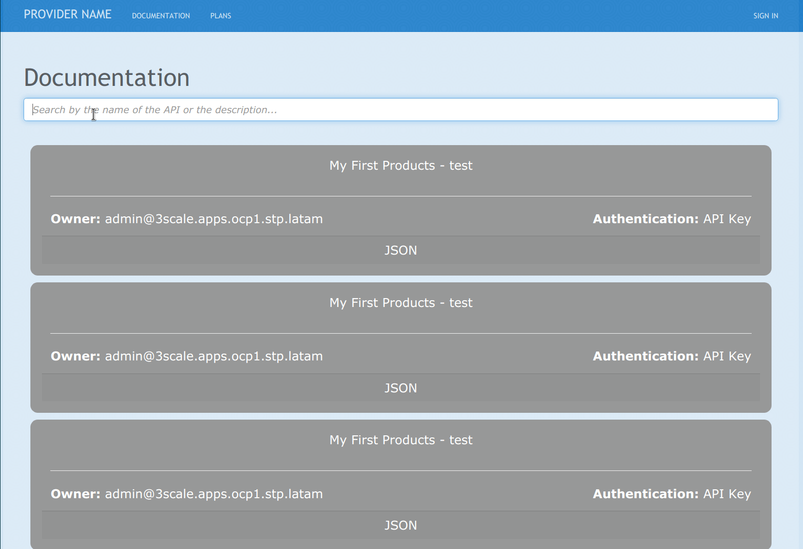

# 3scale Search

This repository can be used as a reference to show a sample code to customize the 3scale's developer portal.

## Features

- [x] Support for several APIs
- [x] Support for hidden ActiveDoc API
- [x] Changes the API block color according to the API state
- [x] Search capabilities in both Documentation and API page
- [x] Pagination feature

## Pre-requisites

In the following list you can find the required components

 - Openshift 4 or Code Ready Containers
 - 3scale 2.10

## Customization process

Replace or upload the contents of the folders in the following list to the CMS developer portal by executing the steps below:

1. Create a new page with the following parameters:

   - Title: `doc.css`
   - Section: `css`
   - Path: `/css/doc.css`
   - Layout: **Empty**
   - Content Type: `text/css`
   - Contents: [doc.css](Root/css/doc.css)

2. Create a new page with the following parameters:

   - Title: `doc.js`
   - Section: `javascripts`
   - Path: `/javascripts/doc.js`
   - Layout: **Empty**
   - Content Type: `text/javascript`
   - Contents: [doc.js](Root/javascripts/doc.js)

3. Replace the contents of the Layout `Main Layout` with [Main_layout](Layouts/Main_layout.html).

4. Replace the contents of the Documentation page with [Documentation](Root/Documentation.html)

5. Create a new file with the following parameters:

   - Section: `images`
   - Path: `/images/empty-box.png`
   - Attatchment: [empty-box.png](Root/images/empty-box.png)

## Final result 

You should see something like the following picture:

And when you have more APIs than you would need to see

And when you try to go into an API

