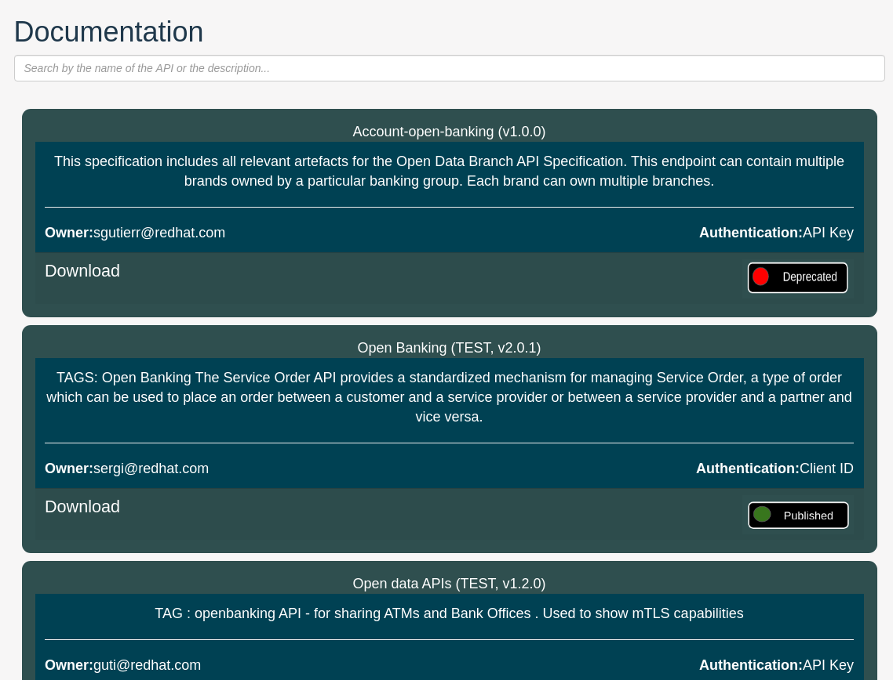

# 3scale Search  
This repository can be used as a reference to show a sample code to customize the 3scale's developer portal.

## Deprecated-Published customization - additional images to add

   - Section: `images`
   - Path: `/images/deprecatedv2.png`
   - Attatchment: [deprecatedv2.png](../Root/images/deprecatedv2.png)

   - Section: `images`
   - Path: `/images/publishedv2.png`
   - Attatchment: [publishedv2.png](../Root/images/publishedv2.png)

## Changes included 

In the following list you can find some small customizations implemented

 - It shows services which at least an ActiveDoc configured. If the service has multiple ActiveDocs it takes the first one
 - It shows the published image when there is at least an 3scale application plan published (subscribable) and the deprecation image otherwise.
 - It includes some service metadata such as:
   - Owner: support email per service defined in 3scale administration console.
   - Description: the text filled in the service description field.
   - Authentication: method used for authenticate the API

## Final result 

You should see something like the following picture:

